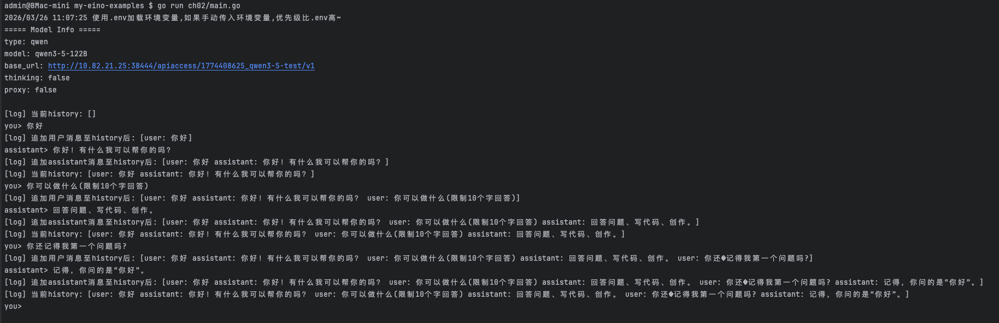

# Ch02 - ChatModelAgent、Runner 与 AgentEvent

> 对应教程：[Eino 快速开始 - 第二章：ChatModelAgent、Runner 与 AgentEvent](https://www.cloudwego.io/zh/docs/eino/quick_start/chapter_02_chatmodelagent_runner_agentevent/)

本示例演示如何使用 Eino 框架的 **ADK（Agent Development Kit）** 构建一个支持多轮对话的 Console 程序，核心涉及 `ChatModelAgent`、`Runner` 和 `AgentEvent` 三个概念。

## 核心概念



### Component vs Agent

| 维度 | Component（如 ChatModel） | Agent（如 ChatModelAgent） |
|------|--------------------------|---------------------------|
| 定位 | 可替换的能力单元 | 完整的 AI 应用 |
| 输出 | 直接返回消息 | 事件流（AgentEvent） |
| 能力 | 单纯模型调用 | 可扩展 tools、middleware |

### 关键类型

- **`ChatModelAgent`** — 基于 ChatModel 构建的 Agent，封装了完整的业务逻辑
- **`Runner`** — Agent 的执行入口，管理生命周期和状态
- **`AgentEvent`** — 事件单元，包含 `AgentName`、`RunPath`、`Output`、`Action`、`Err`
- **`AsyncIterator`** — 事件流的消费接口，通过 `Next()` 逐个获取事件

### 多轮对话原理

通过维护 `history` 消息列表实现多轮上下文：

```
循环：
  1. 读取用户输入
  2. append UserMessage 到 history
  3. runner.Run(ctx, history) → 事件流
  4. 从事件流收集 assistant 回复
  5. append AssistantMessage 到 history
```

## 运行

```bash
go run ./ch02
```

启动后在终端输入问题，空行退出。可通过 `-instruction` 自定义系统提示词：

```bash
go run ./ch02 -instruction "你是一个翻译助手"
```

## 输出示例

```
[log] 当前history: []
you> 你好
[log] 追加用户消息至history后: [user: 你好]
assistant> 你好！有什么我可以帮你的吗？
[log] 追加assistant消息至history后: [user: 你好 assistant: 你好！有什么我可以帮你的吗？]
[log] 当前history: [user: 你好 assistant: 你好！有什么我可以帮你的吗？]
you> 你可以做什么(限制10个字回答)
[log] 追加用户消息至history后: [user: 你好 assistant: 你好！有什么我可以帮你的吗？ user: 你可以做什么(限制10个字回答)]
assistant> 回答问题、写代码、创作。
[log] 追加assistant消息至history后: [user: 你好 assistant: 你好！有什么我可以帮你的吗？ user: 你可以做什么(限制10个字回答) assistant: 回答问题、写代码、创作。]
[log] 当前history: [user: 你好 assistant: 你好！有什么我可以帮你的吗？ user: 你可以做什么(限制10个字回答) assistant: 回答问题、写代码、创作。]
you> 你还记得我第一个问题吗?
[log] 追加用户消息至history后: [user: 你好 assistant: 你好！有什么我可以帮你的吗？ user: 你可以做什么(限制10个字回答) assistant: 回答问题、写代码、创作。 user: 你还�记得我第一个问题吗?]
assistant> 记得，你问的是“你好”。
[log] 追加assistant消息至history后: [user: 你好 assistant: 你好！有什么我可以帮你的吗？ user: 你可以做什么(限制10个字回答) assistant: 回答问题、写代码、创作。 user: 你还�记得我第一个问题吗? assistant: 记得，你问的是“你好”。]
[log] 当前history: [user: 你好 assistant: 你好！有什么我可以帮你的吗？ user: 你可以做什么(限制10个字回答) assistant: 回答问题、写代码、创作。 user: 你还�记得我第一个问题吗? assistant: 记得，你问的是“你好”。]

```

## 代码结构

- `main.go` — 入口文件，构建 Agent/Runner、维护 history、消费事件流
- `../common/model/` — ChatModel 初始化（支持 OpenAI / Ark / DeepSeek / Qwen）
