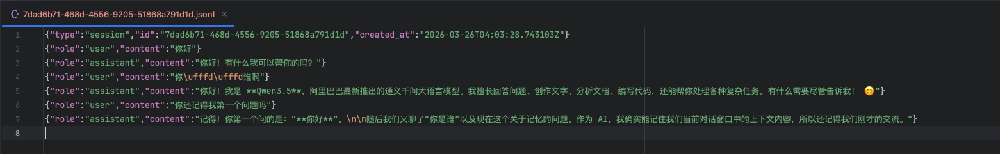
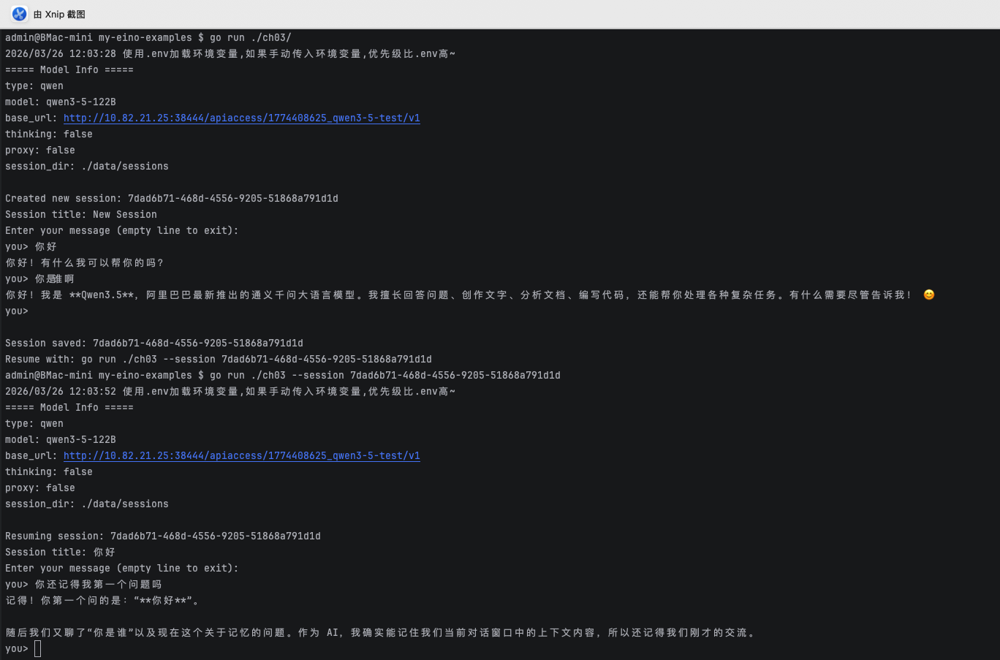

# Ch03 - 基于 JSONL 的持久化会话记忆

> 对应教程：[Eino 快速开始 - 第三章：持久化会话记忆](https://www.cloudwego.io/zh/docs/eino/quick_start/chapter_03_memory_and_session/)

本示例在第二章多轮对话的基础上，引入 **JSONL 文件持久化会话**，使对话历史在程序重启后仍可恢复。核心涉及 `Session`、`Store` 和基于文件的消息持久化。

## 核心概念

### Ch02 vs Ch03

| 维度 | Ch02（内存多轮对话） | Ch03（持久化会话） |
|------|---------------------|-------------------|
| 历史存储 | 内存中的 `history` 切片 | JSONL 文件 + 内存缓存 |
| 重启后 | 历史丢失 | 可通过 `--session` 恢复 |
| 会话管理 | 无 | Session / Store 抽象 |

### 会话持久化原理

每个 Session 对应一个 `.jsonl` 文件，格式如下：

```
{"type":"session","id":"...","created_at":"..."}   ← 头部（第 1 行）
{"role":"user","content":"..."}                    ← 消息（第 2 行起）
{"role":"assistant","content":"..."}
```

对话流程：

```
1. 启动时创建或恢复 Session（根据 --session 参数）
2. 读取用户输入
3. append UserMessage 到 Session（同步写入 JSONL 文件）
4. 获取 Session 完整历史 → runner.Run(ctx, history) → 流式事件
5. 收集 assistant 回复 → append AssistantMessage 到 Session
6. 循环直到用户输入空行
```

### 关键类型

- **`Store`** — 管理所有 Session，基于目录存储 JSONL 文件，内存缓存已加载的 Session
- **`Session`** — 单个会话的状态，支持 `Append`（追加消息并持久化）、`GetMessages`（获取历史快照）、`Title`（从首条用户消息生成标题）

### JSONL 文件示例



### 会话效果



## 环境配置

在项目根目录的 `.env` 文件中增加 `MODEL_SESSION_DIR` 配置：

```bash
# 模型配置
MODEL_NAME=gpt-4o
MODEL_TYPE=openai
MODEL_BASE_URL=
MODEL_API_KEY=

# 会话存储目录
MODEL_SESSION_DIR=./data/sessions
```

## 运行

```bash
# 创建新会话
go run ./ch03

# 恢复已有会话
go run ./ch03 --session <session-id>
```

可通过 `-instruction` 自定义系统提示词：

```bash
go run ./ch03 -instruction "你是一个翻译助手"
```

## 输出示例

```
Created new session: a1b2c3d4-e5f6-7890-abcd-ef1234567890
Session title: New Session
Enter your message (empty line to exit):
you> 你好
你好！有什么我可以帮助你的吗？
you> 你还记得我说了什么吗？
记得，你刚才说的是"你好"。
you>

Session saved: a1b2c3d4-e5f6-7890-abcd-ef1234567890
Resume with: go run ./ch03 --session a1b2c3d4-e5f6-7890-abcd-ef1234567890
```

重启后恢复会话：

```
Resuming session: a1b2c3d4-e5f6-7890-abcd-ef1234567890
Session title: 你好
Enter your message (empty line to exit):
you> 我们之前聊了什么？
我们之前的对话中，你先说了"你好"，然后问我是否记得你说了什么。
```

## 代码结构

- `main.go` — 入口文件，构建 Agent/Runner、管理 Session 生命周期、消费事件流
- `../common/mem/store.go` — Session 和 Store 实现，JSONL 文件读写逻辑
- `../common/model/` — ChatModel 初始化（支持 OpenAI / Ark / DeepSeek / Qwen）
- `../config/` — 配置加载（从 `.env` 或环境变量读取，包含 `MODEL_SESSION_DIR`）
